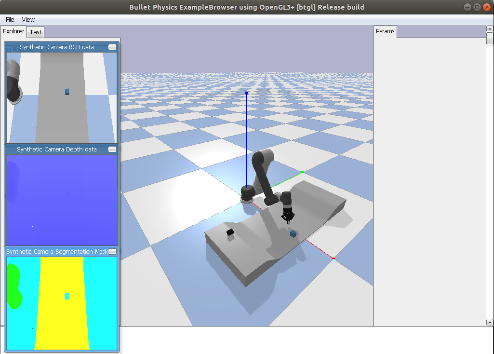

# DensePhysNet-Simulation

## Prerequisites

The code is built with following libraries (see [requirements.txt](requirements.txt)):
- Python
- pybullet
- scikit-image
- sklearn
- Shapely
- trimesh==2.32.5 (The latest version doesn't work.)

## Run Simulation
```python sim.py --step 10```
configuation can be modified in [config.py](config.py), such as object_num, camera parameters.

If the GUI is enabled, it will launch a window like this:

